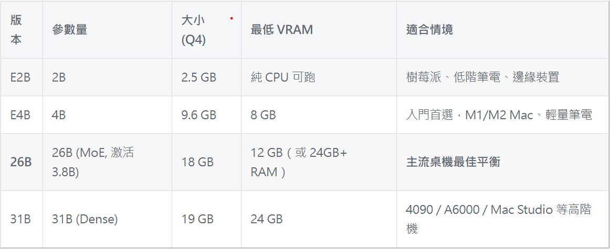
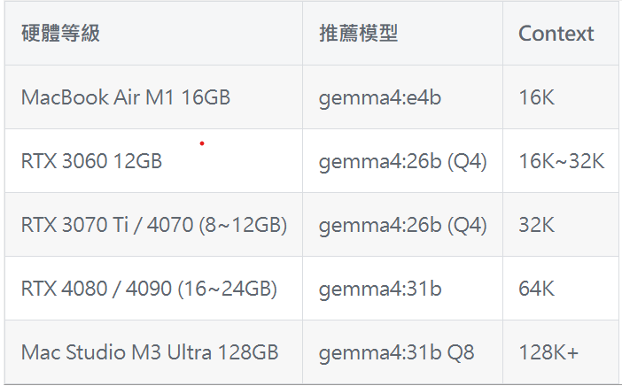
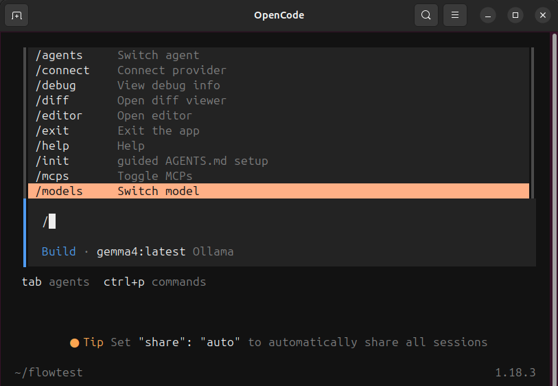
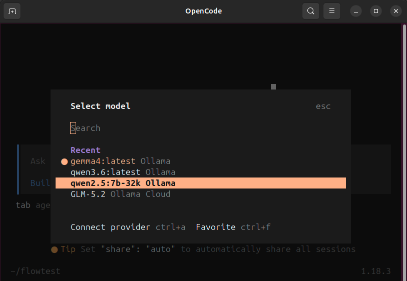

# Local-Coding-Agent

Building a fully local, offline-capable AI coding agent from scratch: automated setup, MCP tool integration, official Claude Skills support, model benchmarking, and (optionally) remote access from a desktop client.

## Overview

This project documents and automates the process of turning a bare Linux machine with a GPU into a working local coding agent. It uses [OpenCode](https://github.com/sst/opencode) as the agent runtime, [Ollama](https://ollama.com) to serve local LLMs (Gemma, Llama, etc.), MCP (Model Context Protocol) servers for tool-calling against real systems, and Anthropic's official Skills format for teaching the agent domain-specific workflows.

## Architecture

```
opencode-install-linux.sh   →  one-shot automated setup (Ollama + OpenCode + system deps + model + config)
~/.config/opencode/
  ├── opencode.jsonc         →  provider config: points OpenCode at local Ollama instead of a cloud API
  ├── skills/                →  cloned from anthropics/skills, teaches the agent domain workflows
  └── ...
Ollama                       →  serves local models (Gemma4, Llama3.1, etc.) via /api/generate
MCP servers                  →  give the agent real tool-calling ability against external systems
                                 (example in this repo: Node-RED)
benchmark scripts            →  gemma_benchmark.py (speed + accuracy), leetcode_benchmark.py (coding
                                 accuracy, sandboxed in Docker)
```

## Hardware Specifications

Benchmarks and setup in this repo were run on the following hardware (adjust the reference tables in section 1 for your own setup):

| Component | Spec |
|---|---|
| Machine type | x86 desktop |
| GPU | NVIDIA GeForce RTX 5090, 32 GB GDDR7 VRAM |
| System RAM | 31 GB |
| Inference engine | Ollama |

### Reference: model size vs. VRAM requirements



### Reference: recommended model by hardware tier



## Tech Stack

| Layer | Technology |
|---|---|
| Agent runtime | OpenCode (`opencode-ai` npm package) |
| Local inference | Ollama |
| Models tested | Gemma4 (26B / 31B), Llama 3.1 (70B, quantized) |
| Tool-calling | MCP (Model Context Protocol) |
| Agent knowledge / workflows | Anthropic Skills format |
| Benchmarking | Python 3 (standard library only, no pip installs needed) |
| Sandboxed code execution (benchmark) | Docker |

## 1. Automated Setup: `opencode-install-linux.sh`

A single script that takes a bare machine to a working local agent. Run stages individually or all at once:

```bash
./opencode-install-linux.sh [stage]
```

| Stage | What it does |
|---|---|
| `check` | Environment check only, no changes made, just reports current state |
| `ollama` | Installs Ollama (if not already present) and starts the service |
| `prereq` | Installs OpenCode (npm package `opencode-ai`) |
| `system` | Installs system dependencies: clipboard tools, `python3-venv` |
| `model` | Pulls the base model and builds a large-context-window variant |
| `configure` | Writes global config files (`opencode.jsonc`, `auth.json`, `tui.json`) |
| `ollama-tune` | Tunes the Ollama service: context ceiling, Flash Attention, KV cache quantization |
| `verify` | Runs full verification, prints a summary table and manual follow-up checks |
| `all` | Runs everything above in order (default when no argument is given) |

### Key implementation notes

- **Model context window**: the base model defaults to a 4096-token context. The script builds a custom variant via a `Modelfile` (`ollama create <model>-32k -f Modelfile`) with `PARAMETER num_ctx 32768` baked in. This is necessary because relying on the OpenAI-compatible endpoint's runtime `options` field alone does not reliably override context length.
- **Global vs. per-model context ceiling**: `OLLAMA_CONTEXT_LENGTH` (set via a systemd override, not by editing the Ollama service file directly) acts as a hard ceiling. If it's set lower than an individual model's `num_ctx`, it silently overrides the model setting. This mismatch is the most common cause of conversations getting truncated or the model losing track of context.
- **GPU-only tuning**: `OLLAMA_FLASH_ATTENTION=1` and `OLLAMA_KV_CACHE_TYPE=q8_0` are applied only when an NVIDIA GPU is detected. Both are performance/memory optimizations, not requirements. The agent works without them, just less efficiently.
- **npm postinstall approval**: after `npm i -g opencode-ai@latest`, you must run `npm approve-scripts --allow-scripts-pending`. Skipping this results in the package installing but the `opencode` command not being found.
- **Verification step**: beyond `opencode --version`, the script recommends a manual tool-calling sanity check (asking the agent to create a file directly, without a text explanation) to catch model/tool-calling compatibility issues early.
- **Switching models on the fly**: OpenCode's `/models` command lists all models available via the connected provider (Ollama, in this setup) and lets you switch mid-session without restarting.





*(Add `opencode-install-linux.sh` itself to this repo alongside this README. This section documents its stages but the executable script should ship with it.)*

## 2. Model Benchmarking

Two complementary benchmark scripts, both dependency-free (standard library only for `gemma_benchmark.py`; `leetcode_benchmark.py` needs Docker for sandboxed execution).

### `gemma_benchmark.py`: Speed & Accuracy

Calls Ollama's `/api/generate` directly and reads the timing fields Ollama returns natively (`prompt_eval_count`, `eval_duration`, etc.) rather than relying on manual stopwatch timing.

```bash
# Speed test only (throughput + latency)
python3 gemma_benchmark.py speed --models gemma4:26b-32k gemma4:31b

# Accuracy test (needs a question bank JSON)
python3 gemma_benchmark.py accuracy --models gemma4:26b-32k gemma4:31b \
    --questions sample_questions.json

# Both, saved to CSV
python3 gemma_benchmark.py all --models gemma4:26b-32k gemma4:31b \
    --questions sample_questions.json --output results.csv
```

- **Throughput (decode tok/s)** = `eval_count / eval_duration`, how fast the model produces output
- **Prefill speed (tok/s)** = `prompt_eval_count / prompt_eval_duration`, how fast the model processes input
- **Speed test** runs 4 task types (long-form writing, Fibonacci, quicksort, debugging) x N repetitions each, to avoid one task type skewing the average
- **Accuracy test** uses fixed multiple-choice question banks, graded automatically (no manual comparison)

### `leetcode_benchmark.py`: Coding Accuracy (sandboxed)

Sends a LeetCode-style problem to the model, extracts the returned code block, assembles it with test cases into a standalone script, and executes it inside an isolated Docker container (`--network none`, memory/CPU limits, auto-cleanup). Never on the host directly.

```bash
python3 leetcode_benchmark.py --models gemma4:26b-64k gemma4:31b-64k \
    --problems sample_leetcode_problems.json --output leetcode_results
```

Results are split by difficulty (easy / medium / hard) and a problem only counts as passed if **all** test cases succeed.

### Benchmark Results Summary

Tested on: RTX 5090 (32GB VRAM), 31GB system RAM, via Ollama.

| Model | Size | decode tok/s | Total latency (s) | Fits in 32GB VRAM |
|---|---|---|---|---|
| gemma4:26b-64k | 17 GB | 170.62 | 23.53 | Yes |
| gemma4:31b-64k | 19 GB | 57.55 | 36.46 | Yes |
| llama3.1:70b-instruct-q2_K | 26 GB | 19.15 | 48.95 | Yes, near the limit |
| gemma4:31b-it-q8_0 | 33 GB | 5.14 | 269.48 | No, offloads to system RAM |

**Key findings:**
- `gemma4:26b-64k` is the fastest of the four, roughly 3x the decode speed of the next model
- Once a model exceeds available VRAM (the 33GB `q8_0` variant), speed collapses by over 30x due to system RAM offload, making it not viable for interactive use
- Decode speed stayed consistent across all four task types per model, confirming the averages aren't skewed by any single task type
- Manual cross-validation (`ollama run --verbose`) on two models came within 7% of the script's automated measurements, treated as within acceptable margin of error

*(Accuracy testing via `leetcode_benchmark.py` / the MC question-bank mode was not yet complete at time of writing. See the full `model_comparison_report.docx` for open items.)*

## 3. Claude Skills

Official Anthropic Skills (cloned from [anthropics/skills](https://github.com/anthropics/skills)) are placed at:

```
~/.config/opencode/skills/
```

Being a user-level (not project-level) path, skills placed here are available to the agent regardless of which project folder `opencode` is started from.

*(Note: this section currently documents where skills live. Add a short note here on which specific skills from the repo are in use / any customizations made, if there are any beyond the defaults.)*

## 4. MCP Integration: Node-RED Example

MCP (Model Context Protocol) lets the agent call real tools against external systems (query state, take action) instead of only generating text you have to copy and run yourself.

### Config structure (`opencode.jsonc`)

```jsonc
{
  "mcp": {
    "node-red": {
      "type": "local",
      "command": ["mcp-node-red"],
      "enabled": true,
      "environment": {
        "NODE_RED_URL": "https://localhost:1880",
        "NODE_RED_TOKEN": "{env:NODE_RED_TOKEN}",
        "NODE_TLS_REJECT_UNAUTHORIZED": "0"
      }
    }
  }
}
```

Multiple MCP servers can be configured side by side; the agent chooses which to call based on the task. Sensitive values (tokens, passwords) should use the `{env:VAR_NAME}` syntax rather than being hardcoded.

### Picking the right package

Search "\<system name\> mcp" (e.g. "node-red mcp"). Watch the direction carefully. Some packages let the target system act as an MCP client calling *other* tools (wrong direction for this use case), while others expose the target system's API *to* an MCP client (the direction needed here, e.g. `mcp-node-red`).

### Verifying a connection, step by step

1. **Confirm the protocol.** Don't assume `http`; test both `http://` and `https://` with `curl -v`. An empty reply from `http` usually means the target is actually serving `https`.
2. **If you get a 401**, exchange credentials for a token via the target system's auth endpoint. Double-check every required parameter (e.g. `scope`) is included. A token issued without the right scope will still return 401 on real requests, indistinguishable from "no token at all."
3. **Verify the token actually works** before wiring it into `opencode.jsonc`. Save it to a file (avoid pasting long strings directly into commands, which can silently corrupt them) and test it against the real endpoint you intend to use.
4. **Write the verified config into `opencode.jsonc`.**
5. **Restart OpenCode** (config isn't hot-reloaded mid-session) and test with a real tool call, e.g. "list all current flow tabs using the node-red MCP." A "Connected" status only confirms the stdio link between OpenCode and the MCP server process, not that the MCP server can actually reach the external system.

### Operating habits that matter

- Break complex multi-step requests into one step at a time. A single compound instruction ("add several things and wire them all together") is much more likely to cause the model to skip a step or lose track mid-task.
- **Don't trust the model's self-reported success.** Small local models can fabricate plausible-looking IDs or claim to have verified something they didn't. Cross-check independently via the system's own API (e.g. `curl` + `grep` against the raw response) rather than taking "done" at face value.
- Keep working files out of `/tmp` (can be cleared unexpectedly). Use a dedicated folder under your home directory instead.

## 5. Remote Access & Permission Control

*(To be completed. This section covers connecting to the agent from the OpenCode Desktop client and setting up password-based access control. Add the specific setup steps here: how the server side is exposed, how the desktop client is pointed at it, and how the password/permission gate is implemented.)*

## Status

Actively evolving. Speed/latency benchmarking is complete; accuracy benchmarking (both multiple-choice and LeetCode-style coding tasks) is in progress. MCP integration demonstrated with Node-RED as the reference case; the pattern generalizes to other MCP-compatible systems.

## References

- [OpenCode install guide, step by step (2026)](https://www.nxcode.io/zh-TW/resources/news/opencode-install-guide-step-by-step-2026): install script reference
- [OpenCode architecture deep dive](https://zengineer.blog/blog/tech/opencode-architecture-deep-dive/): install script reference
- [OpenCode + Gemma4 local AI coding agent tutorial](https://www.itnotetk.com/2026/04/19/opencode-gemma4-local-ai-coding-agent-tutorial/): install script reference
- [Gemma4 benchmark methodology](https://klab.tw/2026/06/gemma4-benchmark/): design basis for both `gemma_benchmark.py` and `leetcode_benchmark.py`
